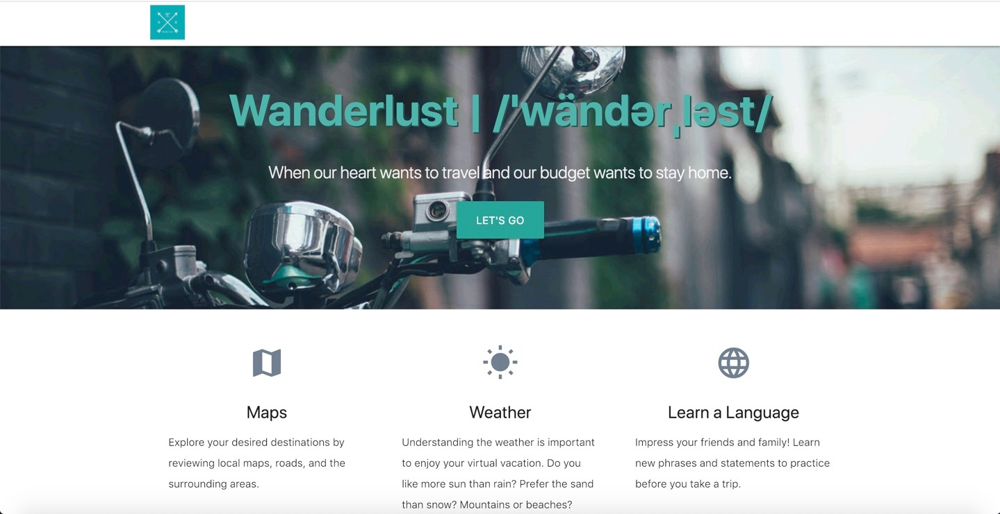
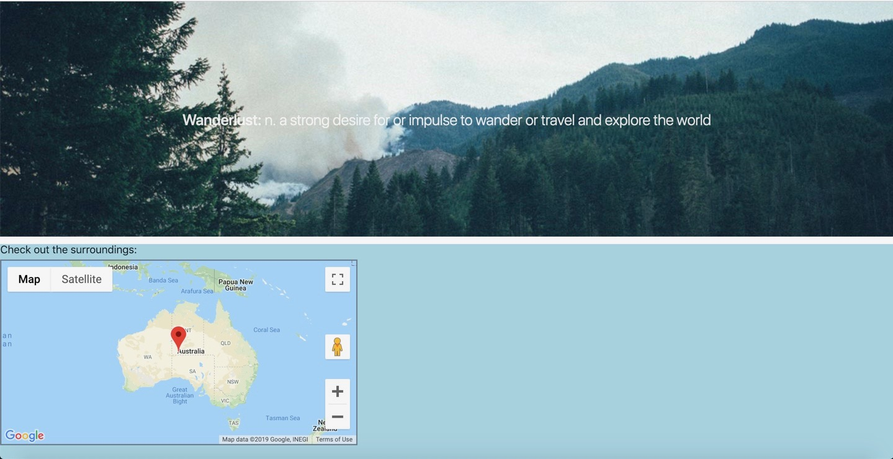
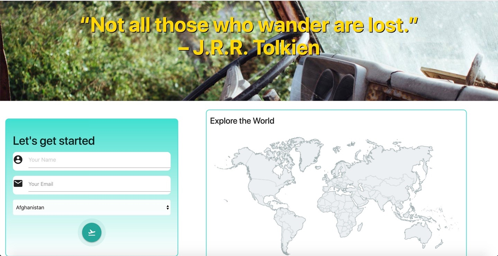
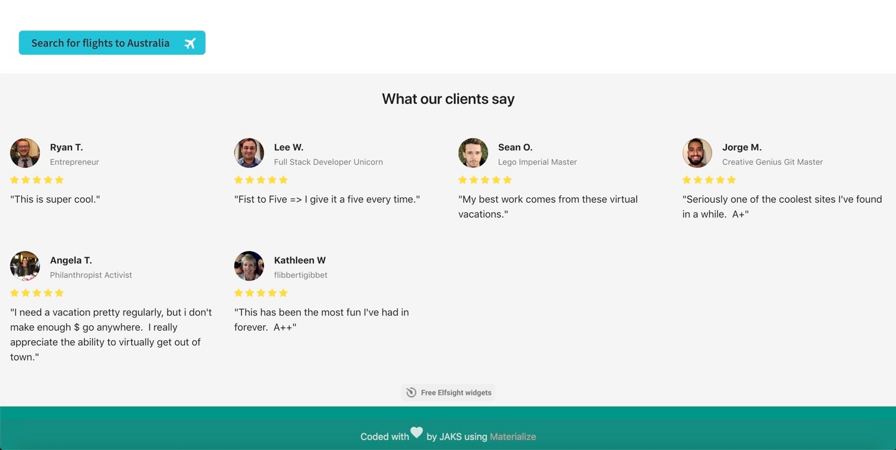

# Wanderlust | /ˈwändərˌləst/

An app to explore potential destinations and to take a virtual vacation. You can explore current weather, language and view location and flights about your country of interest.

## Table of contents

* [About this project](#about-this-project)
* [Project requirements](#project-requirements)
* [Live](#live)
* [Structure of the project](#structure-of-the-project)
* [Logo](#logo)
* [Screenshots](#screenshots)
* [Technologies used to create app](#technologies-used)
* [How to use the OpenWeatherMap API](#OpenWeatherMapAPI)
* [How to use the restcountries API](#restcountriesapi)
* [How to use the google maps API](#googlemapsapi)
* [How to use the app](#how-to-use-app)
* [Form input validation](#form-input-validation)
* [Future enhancements](#future-enhancements)
* [Project contributers](#project-contributers)

##  About this project

This project is a virtual vacation application that incorporates several API calls and features. The app has an input form to local storage for user’s name, email and country selection. After a user submits the form, the app retrieves this information with multiple API's. Rest countries API pulls the country input selected and provides information such as language, currency and capital city. Once this call completes the capital city information is then applied to both the Open Weather Map API and Google Maps API to display current weather and map of the location. Another fun feature links to sky scanner to look up flight information. Also, included are reviews from customers and the option to leave a review yourself.

##  Project requirements

<li>Must use at least two APIs</li>
<li>Must use AJAX to pull data</li>
<li>Must utilize at least one new library or technology that we haven’t discussed</li>
<li>Must have a polished frontend / UI</li> 
<li>Must meet good quality coding standards (indentation, scoping, naming)</li>
<li>Must NOT use alerts, confirms, or prompts (look into modals!)</li>
<li>Must have some sort of repeating element (table, columns, etc.)</li>
<li>Must use Bootstrap or Alternative CSS Framework</li>
<li>Must be Deployed (GitHub Pages)</li>
<li>Must have User Input Validation</li>

##  Live
App is available live through GitHub pages:

https://joura210.github.io/Wanderlust/

##  Structure of the project
<ul>
<li>index.html</li>
<li>css</li>
    <ol>cssmap-continents - includes map images</ol>
    <ol>materialize.css</ol>
    <ol>materialize.min.css</ol>
    <ol>style.css</ol>
<li>images</li>
    <ol>background1.jpg</ol>
    <ol>background2.jpg</ol>
    <ol>background3.jpg</ol>
<li>js</li>
    <ol>app.js</ol>
    <ol>init.js</ol>
    <ol>materialize.js</ol>
    <ol>materialize.min.js</ol>

<li>User completes input fields name, email and country of choice.</li> 
<li>Information is submitted to local storage once submit button is clicked.</li> 
<li>Using AJAX call to the rest countries API to pull information on the country, capital city, currency, language and flag of the country.</li>
<li>From the results of the rest countries API capital city calls the open weather map API to pull the current weather and google map.</li>
</ul>

##  Logo
We created our own unique logo using Hatchful.shopify. Hatchful.shopify is a free logo making site, that provides many different style types to make it your own.

##  Screenshots
Images of Wanderlust site

##  Technologies used to create the app
<li>HTML5</li>
<li>CSS</li>
<li>Materialize (https://materializecss.com/)</li>
<li>Javascript</li>
<li>JQuery (https://jquery.com/)</li>
<li>Firebase</li>

##  How to use OpenWeatherMap API
Website: https://openweathermap.org/
<li>Sign up and get an API key (APPID) on your account page. It takes up to 1 hour to activate your API key. We send you a confirmation email as your API key is ready to work.</li>
<li>Start using API for free. Find the complete description of API calls with a list of parameters and examples of responses in API documentation.</li>
<li>Please, use API key in each API call.If you need more features than Free account can give you, look at the options of our monthly subscriptions here. Choose your subscription depending on a number of calls per sec, API availability, service provided, and other features.</li>

##  How to use Rest Countries API
Website: https://restcountries.eu/

REST Countries provides a simple API for getting information about the world's nations via REST calls. These calls allow users to retrieve all available countries or to retrieve a given country's currency, capital city, calling code, region, sub-region, ISO 639-1 language, name, or country code.

## <a name="googlemapsapi></a"> How to use Google Maps API
Website: https://developers.google.com/maps/documentation/
<li>Go to the Google Cloud Platform Console.</li>
<li>From the Project drop-down menu, select or create the project for which you want to add an API key.</li>
<li>From the  Navigation menu, select APIs & Services > Credentials.</li>
<li>On the Credentials page, click Create credentials > API key.</li> 
    <ul>The API key created dialog displays your newly created API key.</ul>
<li>On the dialog, click Restrict Key.</li> 
    <ul>(For more information, see Restricting an API key.)</ul>
<li>On the API key page, under Key restrictions, set the Application restrictions.</li>
    <ul>Select HTTP referrers (web sites).</ul>
    <ul>Add the referrers (follow the instructions).</ul>
    <ul>Click Save.</ul>

##  How to use app
<li>To start click "Lets Go" button to take you to the input box.</li>
<li>Fill input information, "name", "email" and select a country.</li>
<li>Click "submit" button to make API calls.</li>
<li>The Rest Countries API pulls information about a country such as language, currency and capital city.</li>
<li>Once the Rest Countries API completes its call the OpenWeatherApp API using the capital city to give the current weather.</li>
<li>Then pulls the Google Maps API uses capital city to give map location.</li>

##  Form input validation
<li>The app uses form input validation for the user information to check or validate the following:</li>

<ul>The user has entered a value for every field (that is, all fields are required.).</ul>
<ul>This ensures that there are no empty or null values when the form is submitted.</ul> 
<ul>If the user tries to add information when there is an empty or null value.</ul>
<ul>The user enters name, email and selects country.</ul>
<ul>User information is sent to Firebase for storage.</ul>

##  Future enhancements
<li>Email to stay in contact with users, based on user input information.</li>
<li>Add lanuage development based on the country.</li>
<li>Add selection for users to leave a personal review</li>

##  Project contributers
<ol>Jorge - Front End: Respository set-up, Firebase, pseudo-code and app functionality</ol>
<ol>Kathleen - Front End: Wireframe/Styling HTML</ol>
<ol>Angela - Back End: API call/documentation, weather, Readme</ol>
<ol>Sean - API call/documentation, language, nesting API calls</ol>